<!--
**Henryohia/Henryohia** is a ✨ _special_ ✨ repository because its `README.md` (this file) appears on your GitHub profile.

Here are some ideas to get you started:

- 🔭 I’m currently working on ...
- 🌱 I’m currently learning ...
- 👯 I’m looking to collaborate on ...
- 🤔 I’m looking for help with ...
- 💬 Ask me about ...
- 📫 How to reach me: ...
- 😄 Pronouns: ...
- ⚡ Fun fact: ...
-->

# 👋 Hi, I'm Henry Ohia

### IT Support | Networking | System Administration | Web Development

I'm an **Applied Technology professional** with 4+ years of experience in IT support, technical troubleshooting, networking, customer support, and quality assurance.

I enjoy solving technical problems, supporting users, working with networks and infrastructure, and building practical software solutions.

I'm currently completing my **Bachelor's degree in Applied Technology at Brigham Young University-Idaho**, while continuing to develop my skills in **system administration, networking, and software development**.

---

## 🧑‍💻 About Me

* 🖥️ IT Support Specialist with hands-on technical support experience
* 🌐 Networking and infrastructure experience supporting **1,000+ users**
* 📡 Deployed and configured **200+ wireless access points**
* 🔌 Installed and tested **500+ Ethernet connections**
* 🛠️ Handle approximately **30–50 technical support issues weekly**
* 💻 Building web applications with JavaScript and TypeScript
* 🗄️ Working with databases including PostgreSQL
* 🖥️ Building practical system administration projects with Windows Server
* 🎓 Bachelor's in Applied Technology — BYU-Idaho
* 🎯 Interested in IT Support, Networking, System Administration, Technical Support, and Web Development

I believe technology should be **reliable, practical, and easy for people to use**.

---

## 🛠️ Technologies & Tools

### Programming & Web Development

  &nbsp;
  &nbsp;
  &nbsp;
  &nbsp;
  &nbsp;
  &nbsp;
  

### Development Tools

  &nbsp;
  &nbsp;
  &nbsp;
  

### IT & Networking

* Windows & Windows Server
* TCP/IP
* DNS & DHCP
* VPN
* VLAN
* Wi-Fi Networking
* Ethernet & Structured Cabling
* Network Troubleshooting
* Hardware & Software Troubleshooting
* System Administration
* Technical Documentation

---

## 🚀 Featured Projects

### 💼 BizAccess — Business User Management System

A TypeScript-based user management application developed to strengthen my understanding of software development fundamentals.

**Key concepts:**

* TypeScript
* Classes and objects
* Lists
* Recursion
* Asynchronous functions
* Error handling
* Command-line interaction

🔗 [View my GitHub repositories](https://github.com/Henryohia)

---

### 🌐 CSE340 Service Network

A database-driven web application designed to connect volunteers with service opportunities.

**Technologies:**

`Node.js` `Express.js` `EJS` `PostgreSQL` `JavaScript` `HTML` `CSS` `Git`

🔗 **Live Application:** [cse340-ho.onrender.com](https://cse340-ho.onrender.com)

---

### 🏃 Fitness Tracker

A web application created as part of my web development studies.

**Technologies:**

`HTML5` `CSS3` `JavaScript` `Node.js` `GitHub` `Render`

🔗 **Live Application:** [wdd330-fitnesstracker.onrender.com](https://wdd330-fitnesstracker.onrender.com)

---

### 🖥️ Virtual Office IT Infrastructure Deployment

A system administration project focused on designing and deploying a virtual office IT environment.

**Project components:**

* Windows Server 2022
* Virtual file server
* Shared folders and permissions
* Windows Firewall
* Automated external-drive backup
* Technical documentation
* User guide

This project allowed me to apply system administration concepts in a practical environment.

---

## 💼 Professional Experience

### IT Support Specialist

**Systemarts Technologies**

* Resolve approximately **30–50 hardware, software, account, application, and network issues weekly**
* Troubleshoot Windows, DNS/DHCP, VPN, applications, and connectivity issues
* Perform workstation checks and technical assessments
* Maintain accurate technical documentation and service records
* Communicate technical solutions clearly to users

### Technical Support

**T-Borsit High Tech**

* Deployed and configured **200+ TP-Link/Cisco wireless access points**
* Installed and tested **500+ Ethernet connections**
* Supported network environments serving **1,000+ users**
* Worked with IP addressing, DHCP, VLANs, Wi-Fi, switches, and connectivity testing
* Assisted with relocation of a server room containing **10+ servers**
* Worked with routers, switches, firewalls, UPS systems, racks, and patch panels

---

## 🎓 Education & Certifications

**Brigham Young University-Idaho**

Bachelor's in Applied Technology — *In Progress*

**Associate of Applied Science in Applied Technology**

### Certifications & Certificates

* System Administration — BYU-Idaho
* Web & Computer Programming — BYU-Idaho
* Technical Support — Coursera / Skep Foundation
* Electrical Installation — FSD

---

## 📚 Currently Learning

I'm continuously developing my skills in:

* 🖥️ System Administration
* 🌐 Networking & Infrastructure
* 🪟 Windows Server
* 💻 JavaScript
* 🔷 TypeScript
* 🟢 Node.js
* 🗄️ PostgreSQL
* 🌐 Web Application Development
* 🔧 Git & GitHub
* 📝 Technical Documentation

---

## 🎯 What I Bring

### Technical Problem Solving

I approach technical issues systematically, using troubleshooting, testing, documentation, and escalation when necessary.

### Networking Experience

My hands-on experience includes wireless deployments, Ethernet connections, network troubleshooting, and infrastructure support.

### User Support

I enjoy helping technical and non-technical users understand and resolve their technology problems.

### Accuracy & Documentation

I place a strong emphasis on accurate information, documentation, and maintaining reliable records.

### Continuous Learning

I believe the best way to grow technically is to combine learning with hands-on projects and real-world problem solving.

---

## 📊 GitHub Statistics

  

  

   

  <!-- Contribution Streak Stats -->
  

---

### 🛡️ Tech Stack & Badges

---

## 🤝 Let's Connect

I'm interested in connecting with IT professionals, developers, recruiters, and organizations working on practical technology solutions.

---

⭐ Thanks for visiting my profile!

Feel free to explore my repositories and projects.
